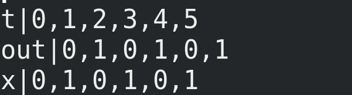
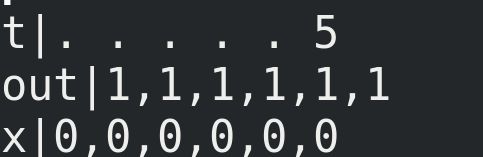
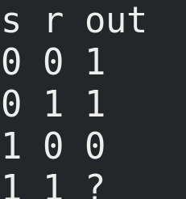
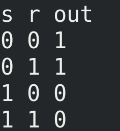
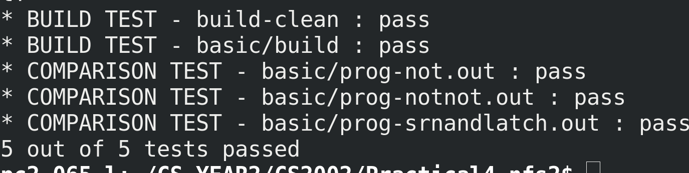

# Practcial4 - Stabilising circuits

------

### Overview

In this practical it was our task to undertake various and implement various tasks related to knowledge of digital circuits with feedback, as well as logic gates and truth tables.

### Specification

A digital circuit with feedback is called stable if the value of each wire (which can be 0 or 1) remains unchanged over time. We say a circuit stabilises if eventually it becomes stable. Some circuits stabilise for certain input values but not for others. In this practical we explored the simulation of digital circuits to determine for which inputs they stabilise. Our task was to write a program, in the C programming language to read and parse a block of CDL (Circuit description language - see appendix for details) text, and translate this into a data structure representing the digital circuit that the CDL text describes, and then simulate this circuit multiple times with different initial input values to compute and output a truth table (see appendix for example of truth table)


### Extensions

For this practical, I implemented two extensions, both of which were recommended and approved.

1. An option for both asynchronous and synchronous simulation.

The recommended and required way for the basic specification is *synchronous* sumulation. This is where the state in each wire at time (t) is calculated by looking at the state of its input wires at time (t - 1). So the state of each wire all change simulatneously, in synchronisation with each other. 

When considering *asynchronous* simulation, there is no ordering, and no time sequence. In other words, the state of each wire at each time is calculated by looking at the

state of each wire also at the current time. So time never 'advances' as such, rather we Iterate through the circuit multiple time repeatedly calculating the state of each wire as function of the states in all other wires in the circuit. 

This is best illustrated with an example: 

My program includes the function:

```{}
void printTimeseries(bool synchronous);
```

where the argument `synchronous` indicates either synchronous (if true) or asynchronous (if false) simulation.

Here is an example of a synchnronous timeseries, calculated with the circuit described the CDL example 1.1 in the appendix, this is calculated with synchronous simulation.




As you can see, the states of both wires change in simulation: Both follow the same sequenece. first 0, then 1, then 0, and so on...
This is because the state of a wire in the circuit is calculated as a function of its input wires at the previous time. 
So, in this case, the state of wire w at time t = 1 is calculated as the inverse of wire v t time t = 0. And the state of wire v at time t = 3 is calculated as the inverse of the state of wire w at time t = 2, and so on...

If however, we were to calculate and print this timeseries asynronously, the ouput of this program is shown below:



Now, we see the state of each wire at time t is calculated as the inverse of its input *at the same time* 


***


2. An option to gradually change the values of the input wires whilst the circuit is still in simulation, to see whether the circuit will stabilise in this way, even if it doesnt stabilise when the same input values are supplied as initial values (i.e when all other wires in the circuit are reset to 0) 

Again, this concept is best illusrated with an example. 

The program includes the function:

```{C}
void printTruthtable(bool resets);
```

where the argument `resets` indicates whether the truth table should be constructed where the value of the input wires gradually changes whilst the circuit is still in simulation (if false) or whether the value of all other wires should be reset to 0 when the inputs are changed (if true.) The basic specification requires this argument to be true by default. The image below shows an example of a truth table, constructed with the circuit described the CDL example 1.2 in the appendix, and computed with this argument set to true (the standard setting).



When we change this argument to false, we cans see below the truth table produced is quite different. This is because, when this argument is true, the initial state of each non-input wire is 0, but when it is true, its initial state is whatever it was at the end of the previous simulation. The initial state of each input may change  whether the it will eventually stabilise or not. 



3. A third of my extensions involves validating user input when parsing the CDL, and is described in more detail in the design section below.
  
*****

### Design

Design:

When designing the program and implementing it, my design decisions were strongly influenced by the requirements, and some of the “simplifying” assumptions made
By the requirements. For example, the choice to have each wire struct have an array of states as an attribute ’int states[max_run_time]' rather than just a single value was due to the synchronous simulation, were each index of the array represents the state of the wire at that time.
There was also some sample code provided for us that demonstrated some useful functionality of reading from stdin line by line. I have used the program ‘doxygen' http://www.stack.nl/~dimitri/doxygen/ along with extensive commenting on the source code to generate automated documentation. These .html files can be found in the ‘/docs’ directory. However, some of my most major decisions, I will discuss in more detail.
One of my most major design decisions was to include the function.

‘’'
bool isCircuitComplete()
‘’’

This function is run after each line of CDL text is processed, and iterate through the whole circuit, and returns true if every wire and gate in the circuit has an appropriate number of inputs and outputs for the specific function of that wire / gate. If any gate/wire in the circuit is ‘loose’ or the circuit is badly formed, this function will never return true. I use this function inside the loop in the main function, to determine at which point to stop reading lines from stdin, and when to break out of the loop, and begin simulating the circuit. This function protects from man possible errors that could arise from attempting to simulate a malformed circuit, and also serves to validate user input, since if the user input (CDL) is mistaken, the program will not end until the user corrects their previous mistakes. 


*****
### Testing

Since the design and specification was relatively complex, I found the program required extensive testing. The were five major tools I used to do this : 

1. Print statements to stdout :
I wrote print statements at the start and end of each function with ‘printf’ which displayed both the value of all arguments passed to each function and the return value. I also wrote print statements
within each conditional branch of every function, and in this way I was able to track and confirm the flow of program at each stage.

2. ‘void printCircuit()’
This was a function that I wrote to print the formation and structure of a circuit after it has been fully formed, to ensure that my internal representation of the circuit was exactly the same as it was intended in the CDL.


2. Lldb debugger
This was particularly useful when dealing with errors such as segmentation faults, which may occur when reading from an address, or accessing a negative index of an array. The debugger was able to point me to the exact function where the fault occurred, as well as the assembly instructions that caused it, and so I was able to identify and correct the problem.

3. Valgrind
Valgrind is a program which is very useful when checking for memory leaks, so I could ensure that all memory allocated on the heap (via ‘malloc’) was correctly freed, and was not able to be accessed by another program, after this program ended. 

5. Stacscheck. I passed all 5 out of 5 stacscheck tests (See appendix for screenshots)

After utilising all of these strategies, I found my program to be very robust and secure.

****


### Running the program

To compile and link the source files needed for the program, please use the Makefile provided, along with the `circuits` target:

```
$ make circuits

```

This should produce the executable `circuits` which can be executed with

```
$ ./circuits < srnandlatch.txt
```
*****

### Evaluation

OIn conclusion, I did find writing this program particularly challenging, and encountered many difficulties along the way. However, I was very pleased with the final result, along with all the extensions that I successfully implemented.
I am confident that I have also personally learnt a great deal concerning digital circuits.

### Appendix

*Example CDL 1.1 : srnandlatch.txt*

s IN
r IN
out NAND s qbar
qbar NAND r out

*Example CDL 1.2 : notnot.txt*

out NOT x
x NOT out

*Stacscheck ouput*




